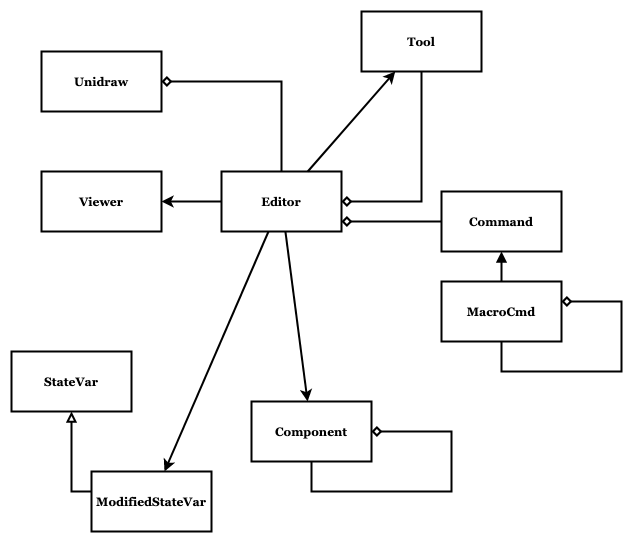

# Multidraw

Multidraw implements an application framework. Not just any framework, the Unidraw framework. It is described by John Vlissides in his paper [Unidraw: A Framework for Building Domain-Specific Graphical Editors](https://dl.acm.org/doi/pdf/10.1145/73660.73680).

Multidraw depends on [FLTK](https://www.fltk.org/) for multi-platform user interface support.

Git repository at [metatooth/libmultidraw](https://github.com/metatooth/libmultidraw)



Original source from [vectaport/ivtools](https://github.com/vectaport/ivtools)

## Getting Started

### Install dependencies

```$ sudo apt install conan cmake build-essentials clang clang-tidy```

### Get and build

```
$ git clone libmultidraw
$ cd libmultidraw
$ mkdir _build && cd _build
$ conan install -s compiler=clang -s compiler.version=14 ..
$ cmake ..
$ make
```

## LICENSE

Multidraw is released under the [MIT License](LICENSE). Note that many parts of the codebase are copyright:

```
/*
 * Copyright (c) 1990, 1991 Stanford University
 *
 * Permission to use, copy, modify, distribute, and sell this software and its
 * documentation for any purpose is hereby granted without fee, provided
 * that the above copyright notice appear in all copies and that both that
 * copyright notice and this permission notice appear in supporting
 * documentation, and that the name of Stanford not be used in advertising or
 * publicity pertaining to distribution of the software without specific,
 * written prior permission.  Stanford makes no representations about
 * the suitability of this software for any purpose.  It is provided "as is"
 * without express or implied warranty.
 *
 * STANFORD DISCLAIMS ALL WARRANTIES WITH REGARD TO THIS SOFTWARE,
 * INCLUDING ALL IMPLIED WARRANTIES OF MERCHANTABILITY AND FITNESS.
 * IN NO EVENT SHALL STANFORD BE LIABLE FOR ANY SPECIAL, INDIRECT OR
 * CONSEQUENTIAL DAMAGES OR ANY DAMAGES WHATSOEVER RESULTING FROM LOSS OF USE,
 * DATA OR PROFITS, WHETHER IN AN ACTION OF CONTRACT, NEGLIGENCE OR
 * OTHER TORTIOUS ACTION, ARISING OUT OF OR IN CONNECTION
 * WITH THE USE OR PERFORMANCE OF THIS SOFTWARE.
 */
```
